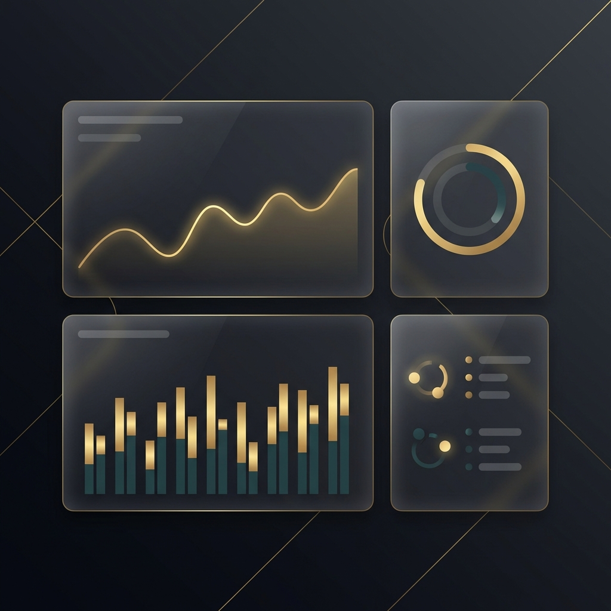

# Luxe Admin Dashboard



A professional, high-end admin dashboard built with **Next.js 15**, **Tailwind CSS**, and **Shadcn/UI**. This project features a sophisticated "Midnight Luxe" aesthetic, combining deep dark tones with gold accents and cinematic glassmorphism.

## ✨ Features

- **📊 Advanced Analytics**: Real-time sales telemetry and interactive data visualizations.
- **🚀 Seamless Navigation**: fully interactive sidebar with collapsible sub-menus and SPA-style routing.
- **🔍 Global Command Palette**: Instant access to any page or action via `Cmd+K`.
- **📦 Inventory Management**: Specialized screens for Products, Categories, and Stock monitoring.
- **👥 Customer Management**: Searchable, stateful customer directory with functional CRUD interactions.
- **🔔 Notification Center**: Real-time toast notifications and integrated alert history.
- **👤 User Profiles**: Dynamic profile management with glassmorphism UI components.

## 🛠️ Tech Stack

- **Framework**: [Next.js 15 (App Router)](https://nextjs.org/)
- **Styling**: [Tailwind CSS 4](https://tailwindcss.com/)
- **Components**: [Shadcn UI](https://ui.shadcn.com/)
- **Icons**: [Lucide React](https://lucide.dev/)
- **Animation**: [Framer Motion](https://www.framer.com/motion/) & Tailwind Transitions
- **State Management**: React Context API

## 🚀 Getting Started

1. **Clone the repository**:
   ```bash
   git clone https://github.com/ahmed9088/luxe-store-admin-dashboard-using-next.js.git
   ```

2. **Install dependencies**:
   ```bash
   npm install
   ```

3. **Run the development server**:
   ```bash
   npm run dev
   ```

4. **Open in browser**:
   Navigate to [http://localhost:3000](http://localhost:3000)

## 🎨 Design Philosophy

Luxe Admin follows a **premium-first** design approach. Every interaction is designed to feel cinematic and high-end, utilizing:
- **Glassmorphism**: Subtle backdrops and translucent borders.
- **Micro-animations**: Transition-based feedback for all interactive elements.
- **Hierarchy**: Clear typography and visual weight to guide the user's attention.

---

Built with ❤️ by [Ahmed Saffar](https://github.com/ahmed9088)
